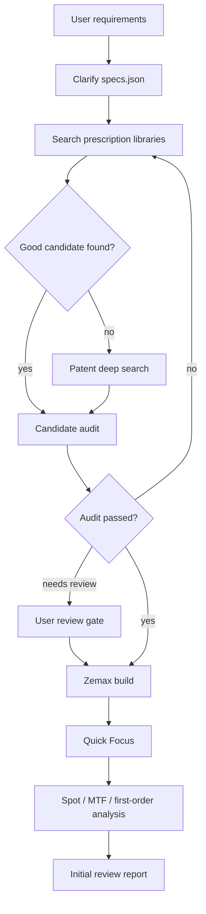

# Workflow Notes

## End-To-End Flow

## Minimum Viable Review

The minimum acceptable review must include:

- Source provenance.
- Candidate search rationale.
- Requirement pass/fail table.
- Prescription conversion audit.
- ZMX file path.
- Quick Focus result.
- At least one optical analysis output.
- Clear distinction between starting point and final design.

## Zemax Build Rules

- Keep source and focused files separately until the focused file has been checked.
- Delete intermediate files only after user confirmation.
- Use automatic semi-diameter solves for ordinary lens surfaces when aperture data is uncertain.
- Keep aperture stop and image semi-diameter fixed when they define the system.
- Model cover glass with two surfaces.
- Preserve cover glass thickness through focusing.
- Record all source-to-model deviations.

## Patent Search Rules

- Search by performance ratios, not only by exact product name.
- Try multiple patent family members because different pages may expose different tables.
- Prefer sources that contain numerical examples.
- Reject patents with only broad claims and no full prescription.
- Treat folded systems as high risk until coordinate breaks and mirrors are modeled.

